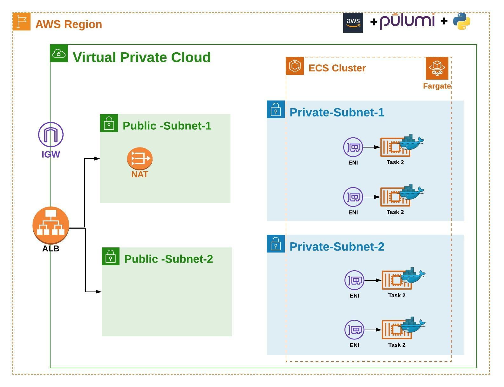

# Tech Insiders Globant 2020

This project deploy a microservice in AWS ECS, this one was create in Python and the infrastructure to support it can be launched by Pulumi.

# Requirements 

* **Pyhton:** Infrastructure and microservices was built in python. you need to install Python version 3.6 or later is required.
* **AWS Account:** The Pulumi code was created to deploy resources in AWS Cloud, you need to have an account and create an IAM user with programmatic access.
* **Pulumi Account:** To store the state of your infrastructure and manage your project you need to create a Pulumi account, please follow this link to more information.

    Go through the Pulumi documentation to install Pulumi CLI
  https://www.Pulumi.com/docs/intro/console/accounts-and-organizations/accounts/
* **Pulumi CLI:** To manage Pulumi you need to install Pulumi CLI, with the CLI you can deploy infrastructure changes in your cloud provider.

    Go through the Pulumi documentation to install Pulumi CLI.
    https://www.Pulumi.com/docs/get-started/install/

# AWS Architecture



# Structure

In the infrastructure folder is the python code used to deploy the AWS resources. This code use python local package and are stores in aws_components folder, this folder contains a package for each component required.
Pulumi uses a python virtual environment, the file requirements.txt is used to specify the package that the code will use into the virtual environment, feel free adding new package if the code requires them.

# Set up an environment

When you create a Pulumi account, Pulumi creates an organization by default, for a free account you can create only one organization. Each organization can have projects and stacks.For the follows steps go to infrastructure directory.

1. Login

    With the account already create and Pulumi CLI installed you can authenticate your terminal with Pulumi service.
    ```sh
    $ pulumi login
    ```
    Pulumi will prompt you for an access token, including a way to launch your web browser to easily obtain one. Also,you can use `PULUMI_ACCESS_TOKEN` environment variable to set the Pulumi token.

2. Create Pulumi project and stack

    Create a file  from `Pulumi.yml.example`  and set it the name Pulumi.yml
    to create the project and stack run:
    ```sh
    $ pulumi stack init <STACK_NAME>
    ```
3. Create a Python virtual environment

    install the dependent packages

    ```bash
    $ python3 -m venv venv
    $ source venv/bin/activate
    $ pip3 install -r requirements.txt
    ```
4. Set AWS Configurations

    Pulumi uses a file named Pulumi.<Stack_Name>.yml, this file is used to specify the configurations for the stack, for instance, the AWS Region or other variable that you want to set for each stack. These configurations can be accessed into the python code.
    For this project you need to set two configurations for each stack, the AWS region in which you want to create the resources and the AWS profile that contains the AWS credentials.

    Configure the AWS credentials into your laptop(for Linux  ~/.aws/credentials), you need to use the following format:
    
    ```bash
    [Profile_name]
    aws_access_key_id = Replace_for_correct_Access_Key
    aws_secret_access_key = Replace_for_correct_Secret_Key
    ```
    
    Run the following commands to set the configurations into the stack
    
    ```bash
    $ pulumi config set  aws_region <AWS_Region>

    $ pulumi config set  aws_profile <AWS_profile>
    ```
# Deploy 

You can make a review of the resources that pulumi will create or modify.
```bash
$ pulumi preview --json 
```

If you are sure that the changes that pulumi will create or modify are the correct, you can apply the changes.
```bash
$ pulumi up
```

# Destroy
If you don't want to maintain the resources created and delete the stack please run:

```bash
$ pulumi destroy

$ pulumi stack rm

$ pulumi logout
```


